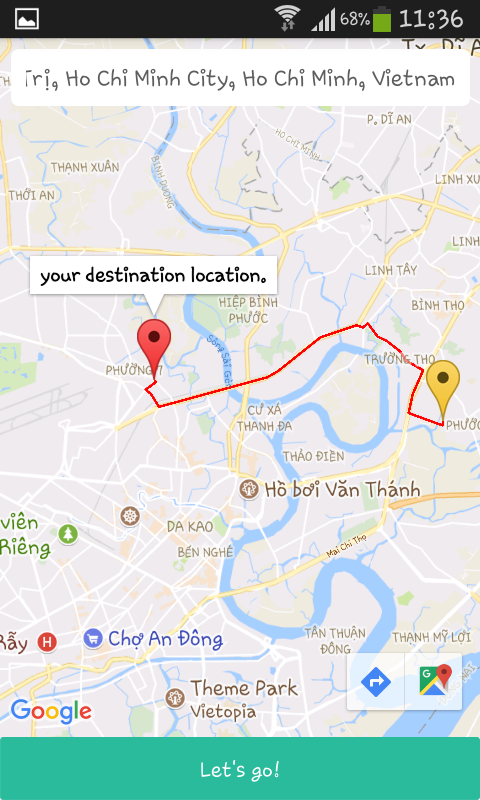

# demo_MapDirection

This is a simple project to make a simple react-native application that can get directions from your current location to your destination.
This project uses React Native, Google Places API Web Service, Google Maps Directions API, Google Maps Android API. 

## Features
* Search autocomplete destination.
* Get directions from your current location to your destination.
* Make a destination by touch on map (create a marker).

## Screenshots





## Getting Started

These instructions will get you a copy of the project up and running on your local machine.

### Prerequisites
1. Get your API key [Google Maps Android API](https://developers.google.com/maps/documentation/android-api/signup) and add key follow Step 2 in Google guides.
2. Get your API key [Google Places API Web Service](https://developers.google.com/places/web-service/get-api-key).
3. Get your API key [Google Maps Directions API](https://developers.google.com/maps/documentation/directions/get-api-key).
4. Add your API keys in project by modifies in src/components/app.js.

```
const MapAPIKey = "your Google Maps Directions API key";
const PlaceAPIKey = "your Google Places API key";
```

### Installing
```
npm install
```
or
```
yarn install
```

## Built With

* [react-native-google-places-autocomplete](https://github.com/FaridSafi/react-native-google-places-autocomplete) - The package for search autocomplete feature.
* [react-native-maps](https://github.com/airbnb/react-native-maps) - The package for map feature.

## Authors

* **Huynh Quang Thai** - [thaihuynhquang](https://github.com/thaihuynhquang)
